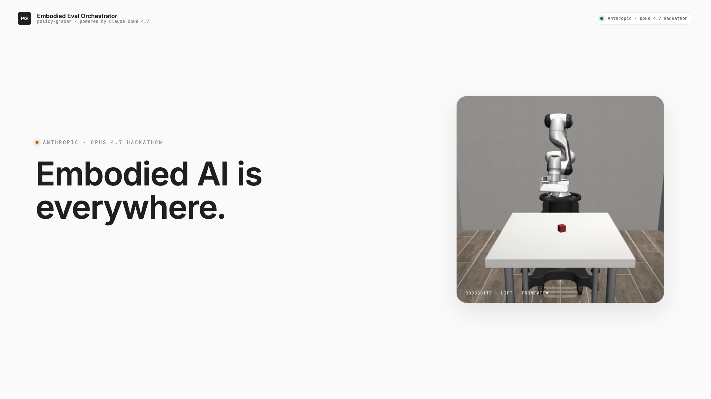
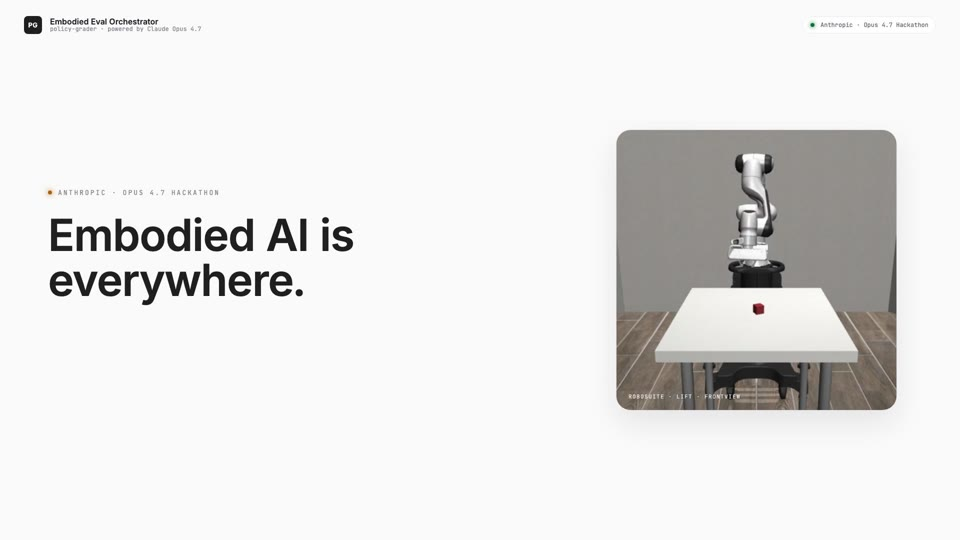
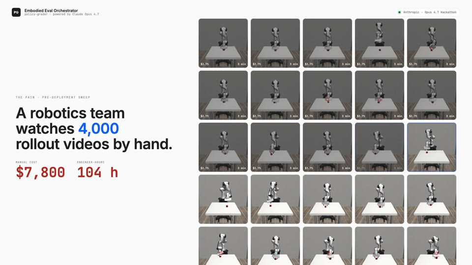
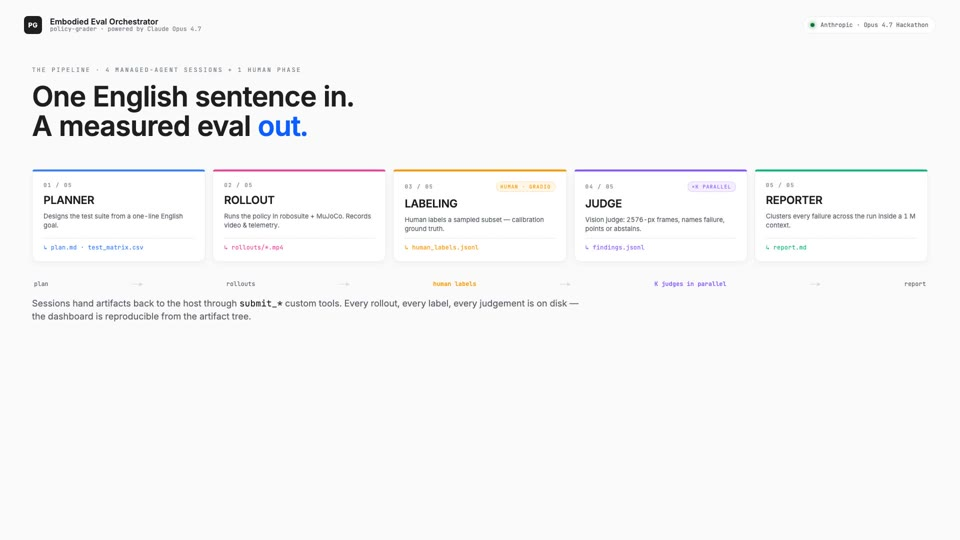
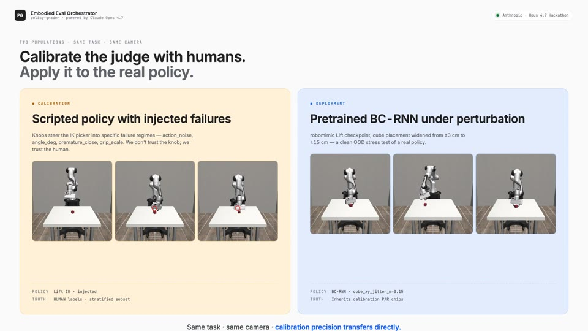
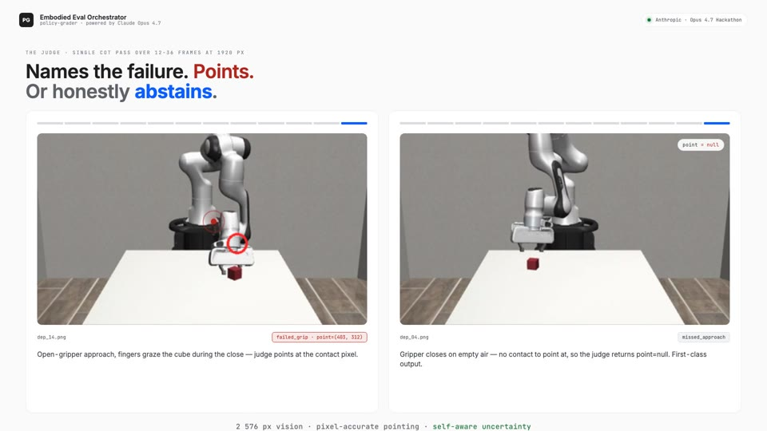
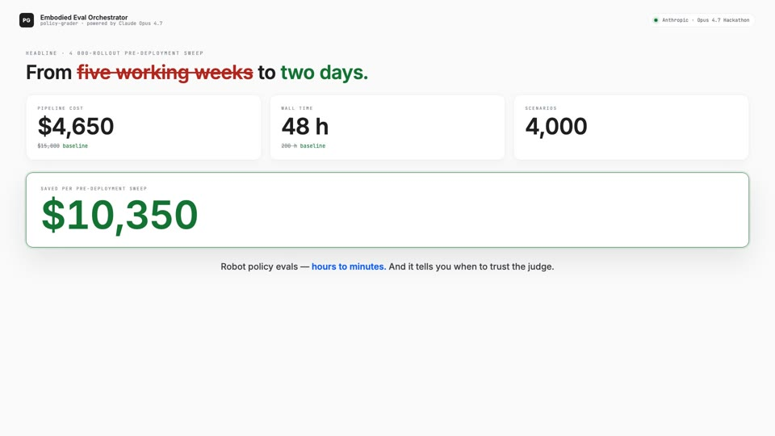

# Embodied Eval Orchestrator

> **Robot manipulation evals — hours to minutes.**
> An agentic system that designs, runs, judges, and reports on robot policy evaluations end-to-end, while measuring its own judge against human ground truth.

<p>
  <a href="#"></a>
  <a href="#"></a>
  <a href="#"></a>
  <a href="#"></a>
  <a href="#"></a>
</p>

<!-- HERO ANIMATION — rendered by `robotics_pitch/` (Remotion, 40 s, 1920×1080).
     Source in robotics_pitch/. Re-render with: `cd robotics_pitch && npm run render`. -->

<p align="center">
  <a href="docs/media/hero.mp4">
    
  </a>
  <br/>
  <sub>▶ <a href="docs/media/hero.mp4">Play the 40-second explainer</a> &middot; source in <a href="robotics_pitch/"><code>robotics_pitch/</code></a></sub>
</p>

<table>
  <tr>
    <td width="33%" align="center"><a href="docs/media/hero.mp4"></a><br/><sub><b>0:00</b> · Title</sub></td>
    <td width="33%" align="center"><a href="docs/media/hero.mp4"></a><br/><sub><b>0:04</b> · The pain</sub></td>
    <td width="33%" align="center"><a href="docs/media/hero.mp4"></a><br/><sub><b>0:10</b> · The pipeline</sub></td>
  </tr>
  <tr>
    <td width="33%" align="center"><a href="docs/media/hero.mp4"></a><br/><sub><b>0:20</b> · Two populations</sub></td>
    <td width="33%" align="center"><a href="docs/media/hero.mp4"></a><br/><sub><b>0:28</b> · The judge</sub></td>
    <td width="33%" align="center"><a href="docs/media/hero.mp4"></a><br/><sub><b>0:34</b> · The numbers</sub></td>
  </tr>
</table>

---

## Why this matters

**Embodied AI will soon be everywhere.** Warehouses, kitchens, hospitals, homes. Every one of those policies has to be *evaluated* before it ships — and evaluation today is a human watching robot videos, frame by frame, for hours.

A robotics team running a typical pre-deployment sweep watches **hundreds of rollouts**, hand-labels each failure mode, clusters them, and writes a memo. It takes days. It is the bottleneck between a working policy and a deployed one.

**Embodied Eval Orchestrator collapses that loop into minutes.** Describe the eval goal in English — an Opus 4.7 Managed Agent designs a test suite, runs rollouts in simulation, **pauses for a human to label a sampled subset** as ground truth, then a vision judge watches every failed rollout, names the failure frame, points at it (or honestly abstains), and a reporter clusters the deployment failures into actionable patterns. The dashboard shows you the cost, the time, the per-label judge precision against human ground truth, and the deployment findings — live.

It’s not a vibes demo. **The system measures its own judge’s reliability and tells you when not to trust it.**

---

## Headline numbers

### Last full run — 25 rollouts, real numbers

From [artifacts/runs/evalb_d5f0ad/runtime.json](artifacts/runs/evalb_d5f0ad/runtime.json) and [report.md](artifacts/runs/evalb_d5f0ad/report.md). Reproducible from the artifact tree.

| Metric | Pipeline | Manual baseline | Ratio |
|---|---|---|---|
| **Cost** | **$29.11** | $93.75 | 0.31× |
| **Wall time** | **18 min 11 s** | 1 h 15 min | 0.24× |
| **Scenarios** | 25 (10 calibration + 15 deployment) | — | — |
| **Calibration success** | 4 / 10 (40 %) — knobs steered seven into failure | — | — |
| **Deployment success** | 11 / 15 (73 %) — BC-RNN under 0.15 m cube jitter | — | — |
| **Failures clustered** | 3 deployment clusters (closed-fingers approach, off-center close, mistimed open) | — | — |

Baseline is $75/hr × 3 min/rollout for cost and 60 s/rollout review overhead + sum of video durations for wall time. Constants live in [src/costing.py](src/costing.py).

### Scaled to one pre-deployment sweep — N = 4 000 rollouts

The per-rollout factors above are linear; a real pre-deployment sweep at a serious robotics lab is hundreds-to-thousands of rollouts. At 4 000 scenarios, the orchestrator saves **over $10 000 of engineering labor and ~5 working weeks of wall time per sweep**. (This is the framing the [animated explainer](robotics_pitch/) uses.)

| | Pipeline | Manual baseline | Δ |
|---|---|---|---|
| **Cost** | **$4 650** | $15 000 | **−$10 350** |
| **Wall time** | **~48 h** (≈ 2 days) | ~200 h (≈ 5 work-weeks) | **−152 h** |
| **Scenarios** | 4 000 | 4 000 | — |

Both rows extrapolate the real per-rollout costs from `evalb_d5f0ad` ($1.164 / rollout pipeline · $3.75 / rollout manual). Numbers in [robotics_pitch/src/theme.ts](robotics_pitch/src/theme.ts).

---

## What it does in 60 seconds

```
                         "Run a Lift eval — 10 calibration + 15 deployment, seeds 0-14"
                                                    │
                                                    ▼
              ┌────────────────────────────────────────────────────────────────────┐
              │  PHASE 1 · PLANNER          Opus 4.7 · Managed Agent               │
              │  Designs the test suite.    plan.md · test_matrix.csv              │
              └─────────────────────────────────┬──────────────────────────────────┘
                                                ▼
              ┌────────────────────────────────────────────────────────────────────┐
              │  PHASE 2 · ROLLOUT          Opus 4.7 · Managed Agent (host main)   │
              │  robosuite + MuJoCo Lift.   rollouts/*.mp4 · *.telemetry.json      │
              └─────────────────────────────────┬──────────────────────────────────┘
                                                ▼
              ┌────────────────────────────────────────────────────────────────────┐
              │  PHASE 2.5 · LABELING       HUMAN, host-side Gradio UI             │
              │  Stratified subset of       labeling_queue.json · human_labels.jsonl
              │  scripted rollouts.                                                │
              └─────────────────────────────────┬──────────────────────────────────┘
                                                ▼
              ┌────────────────────────────────────────────────────────────────────┐
              │  PHASE 3 · JUDGE  ×K        Opus 4.7 · Managed Agents (parallel)   │
              │  2576-px vision, pointing,  findings.jsonl                         │
              │  per-frame chain of thought.                                       │
              └─────────────────────────────────┬──────────────────────────────────┘
                                                ▼
              ┌────────────────────────────────────────────────────────────────────┐
              │  PHASE 4 · REPORT           Opus 4.7 · Managed Agent (1M context)  │
              │  Clusters failures across   report.md                              │
              │  the full findings stream.                                         │
              └────────────────────────────────────────────────────────────────────┘
```

A polished SVG version is committed at [docs/pipeline.html](docs/pipeline.html) (open in any browser). For the long-form architecture: [docs/pipeline-detailed.html](docs/pipeline-detailed.html).

---

## The two populations — load-bearing

Both cohorts run on **the same task, env, and camera (Lift, frontview)**. That’s what lets the per-label judge precision measured on calibration *transfer* directly onto deployment findings.

| | **Calibration** (amber) | **Deployment** (steel blue) |
|---|---|---|
| Policy | Scripted IK picker with knobs that steer behavior toward specific failure modes | Pretrained robomimic BC-RNN (`lift_ph_low_dim.pth`) |
| Source of failures | Injected (`action_noise`, `angle_deg`, `premature_close`, `grip_scale`) | Environmental — `cube_xy_jitter_m` widens cube placement range from ±3 cm to ±15 cm |
| Ground truth | **Human labels** on a sampled subset — `clamp(10 % × N, 6, 20)`, stratified 1/3 success + 2/3 failure | Inherits the calibration-level trust; not independently labeled |
| Role | Measures the judge’s P/R | The thing we actually want to know about |

> **Why this design?** A calibration cohort with no on-task ground truth gives you a vibes demo. Cross-task calibration (Lift → NutAssembly) gives you a P/R that doesn’t transfer. Same-task calibration with human labels gives you a precision number you can attach to every deployment finding.

See [docs/eval_methodology.md](docs/eval_methodology.md) for the full framing and known limitations (engineered vs. natural failure distribution, sub-second event resolution, etc.).

---

## The judge in action — pointing AND abstention

The vision judge runs **once per failed rollout**: a single 1920-px Messages-API call over `clamp(video_duration × 3, 12, 36)` evenly-spaced frames, plus a per-step ASCII telemetry table for evidence. It returns a closed-set label, the exact failure frame index, and a pixel coordinate — **or `null`** when there is nothing to point at.

<table>
<tr>
<td align="center" width="50%">

<br/>
<sub><b>dep_14 · <code>cube_scratched_but_not_moved</code></b><br/>
Open-gripper approach, fingers graze the cube during the closing attempt and nudge it ~2.4 cm before closing on empty space.<br/>
<b>Judge points</b> at the gripper-cube contact. Red dot = <code>JudgeAnnotation.point</code>.</sub>
</td>
<td align="center" width="50%">

<br/>
<sub><b>dep_04 · <code>missed_approach</code></b><br/>
Gripper descends with fingers already shut; never touches the cube.<br/>
<b>Judge abstains</b> — <code>point = null</code>. Forcing a coordinate on no-contact failures is what caused our prior &ldquo;random red dot&rdquo; regressions.</sub>
</td>
</tr>
</table>

The 2-mode outcome taxonomy — `missed_approach` / `failed_grip` (+ `other`) — is documented in [docs/taxonomy.md](docs/taxonomy.md). The decisive cue: **did the cube ever leave the table inside the gripper?** Yes → `failed_grip`. No → `missed_approach`.

---

## What you’ll see in the dashboard

Four tabs. Static mockups are committed at [docs/ui-mockups/](docs/ui-mockups/) — open the HTML files to see the design system rendered.

| Tab | What it shows |
|---|---|
| **Overview** | Cost · time · scenarios hero, 5-phase progress strip, four pipeline cards, the reporter’s `report.md` rendered inline |
| **Live** | Agent activity trace (phase-segmented `chat.jsonl`), current rollout video, gallery of every rollout with population chips |
| **Judge calibration** | Labeling flow (video + radio) at top until every queued rollout is labeled · then confusion matrix + per-label P/R + drill-down |
| **Deployment findings** | **Judge Trust banner** with calibrated precision chips · cluster cards (one per judge label) · deployment-only rollout table |

Top banner is always visible: **`$X spent · Y elapsed · N total (n_cal cal + n_dep dep)`**, with cohort counts in the population colors (amber `#f59e0b` / blue `#38bdf8`).

---

## Quickstart

### Prerequisites

- macOS or Linux (Python 3.12)
- Anthropic API key with access to Opus 4.7 + Managed Agents (research preview; access confirmed on tester orgs)
- ~1 GB disk for the BC-RNN checkpoint and rollout videos
- **No GPU required** — MuJoCo is CPU; everything else is API calls

### Install

```bash
git clone <this-repo> && cd Robotics
uv venv && source .venv/bin/activate
uv pip install -r requirements.txt

cp .env.example .env
# edit .env: set ANTHROPIC_API_KEY=...
# MUJOCO_GL=glfw works on Apple Silicon; if it fails try osmesa or egl
# (see docs/install-mujoco-macos.md)

python scripts/fetch_checkpoints.py
# downloads artifacts/checkpoints/lift_ph_low_dim.pth (~100 MB)
```

### Sanity gate (before any agent run — $0, ~30 s)

If this fails, your sim stack is broken (most likely robosuite was upgraded past 1.4.1) and spending $20+ on a smoke run will just burn money.

```bash
MUJOCO_GL=glfw python -c "
import sys; sys.path.insert(0,'.')
from pathlib import Path
from src.schemas import RolloutConfig
from src.sim.adapter import run_rollout
ck = Path('artifacts/checkpoints/lift_ph_low_dim.pth')
ok = sum(run_rollout(RolloutConfig(rollout_id=f's{s}', policy_kind='pretrained',
                                    env_name='Lift', seed=s, max_steps=200,
                                    checkpoint_path=ck), video_out=None).success for s in range(3))
print(f'BC-RNN sanity: {ok}/3')
assert ok == 3, 'sim stack broken — do not run smoke_agent'
"
```

Expected: `BC-RNN sanity: 3/3`.

### Run the full pipeline (REAL API calls, ~5 min, ~$20)

```bash
python scripts/smoke_agent.py
# or, with explicit knobs:
python scripts/smoke_agent.py --k-workers 4 --skip-labeling
```

Useful flags:

| Flag | Default | Purpose |
|---|---|---|
| `--k-workers` | 4 | Judge phase fan-out (rollouts stay on the host main thread — see “Pitfalls”) |
| `--skip-labeling` | off | Bypass PHASE 2.5; useful for unattended smokes. Calibration shows as “not measured”. |
| `--run-id` | auto | Name the run (default `eval_<6hex>`). |
| `--goal` | preset | One-line eval goal in English; passed verbatim to the planner. |
| `--label-seed` | 0 | Seed for the calibration-subset stratified sampler. |

### Open the dashboard

```bash
python scripts/run_ui.py
# or point at any past run:
python scripts/run_ui.py --runs-root artifacts/runs
```

Opens at `http://localhost:7860`. Pick a run from the dropdown — every artifact mentioned above is rebuildable purely from the on-disk `mirror_root/`.

### Smaller smokes (no API needed)

```bash
MUJOCO_GL=glfw python scripts/smoke_render.py              # render one frame
MUJOCO_GL=glfw python scripts/smoke_scripted_rollout.py    # one scripted Lift rollout
MUJOCO_GL=glfw python scripts/smoke_pretrained_rollout.py  # one BC-RNN rollout (jitter=0)
MUJOCO_GL=glfw python scripts/smoke_pretrained_rollout.py --sweep
                                                            # sweep cube_xy_jitter_m
MUJOCO_GL=glfw python scripts/smoke_parallel_rollouts.py   # multiprocessing test
```

### Lint, type, test

```bash
ruff check . && ruff format . && mypy src/ && pytest -q
```

Integration tests are gated on `@pytest.mark.integration`; CI runs unit tests only.

---

## Repository layout

```
Robotics/
├── README.md                       # this file
├── claude.md                       # the project memory (architecture, vocabulary, anti-patterns)
├── requirements.txt                # robosuite==1.4.1 — pin is load-bearing
├── tokens.css                      # design system (Google Sans / Roboto Mono · amber + blue)
├── DESIGN.md                       # design spec
│
├── src/
│   ├── orchestrator.py             # Multi-agent driver — four sessions + label phase
│   ├── label_phase.py              # PHASE 2.5: host-side labeling queue / wait
│   ├── human_labels.py             # Stratified sampler + HumanLabel persistence
│   ├── schemas.py                  # Pydantic: RolloutConfig, RolloutResult, JudgeAnnotation, HumanLabel, …
│   ├── costing.py                  # Token tracker + manual-review baseline
│   ├── runtime_state.py            # Writes runtime.json + chat.jsonl
│   ├── memory_layout.py            # Canonical /memories/ paths
│   ├── metrics.py                  # Wilson CI, per-label P/R
│   ├── agents/
│   │   ├── system_prompts.py       # Per-phase prompts (planner / rollout / judge / reporter)
│   │   └── tools.py                # Custom tools: rollout, judge, submit_*
│   ├── sim/
│   │   ├── adapter.py              # run_rollout(config) -> RolloutResult — the ONE sim boundary
│   │   ├── policies.py             # Policy interface
│   │   ├── pretrained.py           # BC-RNN loader (1.4-native passthrough)
│   │   └── scripted.py             # Lift IK picker + InjectedFailures
│   ├── vision/
│   │   ├── judge.py                # Single-call CoT judge: 1920 px × 12-36 frames + telemetry
│   │   └── frames.py               # mp4 read · sample_indices · resize · motion-diff
│   └── ui/
│       ├── app.py                  # Gradio entrypoint, tab orchestration
│       ├── synthesis.py            # ScoredRollout, clusters, chips, keyframe overlay
│       ├── metrics_view.py         # Cohort math, drill-down, judge_trust banner
│       └── panes/
│           ├── labeling.py         # Human labeling flow (video + radio + submit)
│           ├── calibration.py      # Confusion matrix + per-label P/R + drill
│           └── findings.py         # Cluster cards + deployment rollout table
│
├── scripts/
│   ├── smoke_agent.py              # End-to-end multi-agent run (REAL API)
│   ├── smoke_render.py             # MUJOCO_GL sanity check
│   ├── smoke_scripted_rollout.py   # One scripted Lift rollout, no API
│   ├── smoke_pretrained_rollout.py # BC-RNN rollout / sweep
│   ├── smoke_parallel_rollouts.py  # Multiprocessing test
│   ├── fetch_checkpoints.py        # Download BC-RNN .pth
│   └── run_ui.py                   # Launch the Gradio dashboard
│
├── tests/
│   ├── test_schemas.py             # Pydantic validators
│   ├── test_sim_adapter.py         # @integration · adapter behavior
│   ├── test_scripted_failure_injection.py  # @integration · knob → failure mode
│   ├── test_human_labels.py        # Stratified sampler + persistence
│   ├── test_costing.py             # Wilson CI · baselines
│   ├── test_synthesis.py           # Cluster math · ScoredRollout
│   ├── test_metrics_view.py        # Cohort · drill filter · label adapter
│   ├── test_metrics.py             # Per-label P/R
│   ├── test_judge_telemetry.py     # Telemetry sidecar formatting
│   ├── test_vision_frames.py       # Frame I/O helpers
│   ├── test_smoke.py               # End-to-end structural assertions
│   └── test_memory_layout.py       # Path constants
│
├── docs/
│   ├── pipeline.html               # At-a-glance architecture diagram (SVG)
│   ├── pipeline-detailed.html      # Long-form architecture
│   ├── eval_methodology.md         # Full framing + limitations
│   ├── taxonomy.md                 # Closed set of judge labels
│   ├── install-mujoco-macos.md     # MUJOCO_GL setup
│   └── ui-mockups/                 # Static HTML mockups of the four tabs
│
└── artifacts/                      # Per-run, gitignored
    ├── checkpoints/lift_ph_low_dim.pth
    ├── runs/<run_id>/              # mirror_root for one eval
    │   ├── runtime.json            # Banner state — what the dashboard reads
    │   ├── chat.jsonl              # Phase markers + agent messages + tool calls
    │   ├── dispatch_log.jsonl      # Every rollout/judge call, args + result
    │   ├── labeling_queue.json     # Host → labeling UI handoff
    │   ├── human_labels.jsonl      # Calibration ground truth
    │   ├── plan.md · test_matrix.csv · taxonomy.md
    │   ├── findings.jsonl · report.md
    │   ├── rollouts/<id>.mp4 + .telemetry.json
    │   └── keyframes/<id>.png      # Judge-named frame · red dot if point != null
    └── smoke/                      # Output of smoke_*.py scripts
```

---

## How the pieces fit — for the curious

### Multi-agent orchestration

Four specialized **Managed Agents sessions** plus one host-side phase. Only the judge phase fans out via `concurrent.futures.ThreadPoolExecutor` — that’s where the wall-clock win comes from (judging is API-bound; rollouts are sim-bound, so fan-out buys nothing). The rollout phase **must** run on the host main thread: on macOS, GLFW’s Cocoa init from a worker thread wedges the process in an `[NSApplication reportException:]` loop.

Each session’s `/memories/` is isolated. Sessions hand artifacts back to the host via `submit_plan` / `submit_results` / `submit_findings` / `submit_report` custom tools, which write to `mirror_root/`. The reporter receives plan + matrix + findings inlined in its first user message — it never reads other sessions’ memory.

Three Opus 4.7 capabilities used visibly:

1. **2576-px vision with pointing.** The judge points at the failure on the keyframe, with `point = null` as a first-class output for no-contact failures.
2. **1M-context window.** The reporter clusters across the full `findings.jsonl` in a single pass — no k-means, no embeddings, just the model holding all 25 rollouts in its head at once.
3. **Managed Agents parallelism.** Research-preview parallel sessions are confirmed on our org; the four phases run as four separate sessions and the judge fans out to K.

### The cost banner is honest

`src/costing.py::CostTracker` accumulates from two sources:

- Managed Agents sessions → `span.model_request_end → model_usage` events
- Direct vision-judge Messages-API calls → `response.usage`

Both are pinned to the live Opus 4.7 pricing constants. The dashboard banner is the actual API spend, not an estimate. Compared against a **$75/hr × 3 min/rollout** manual-review baseline — see [src/costing.py](src/costing.py) for the constants and [docs/eval_methodology.md](docs/eval_methodology.md) for why those numbers.

### Calibration math

Per-label precision and recall come from the join `human_labels.jsonl ⋈ findings.jsonl` — only the rollouts in the labeled subset contribute. Wilson 95 % confidence intervals via `src/metrics.py`. Those per-label precision numbers are the chips that decorate every deployment cluster card in the **Judge Trust** banner.

---

## Constraints &amp; pitfalls

| | |
|---|---|
| 🍎 **macOS rendering** | `MUJOCO_GL=glfw` works on Apple Silicon. If it fails: `osmesa` (`brew install mesa`) or `egl`. See [docs/install-mujoco-macos.md](docs/install-mujoco-macos.md). |
| 🧵 **GLFW + threads** | The rollout phase **must** run on the process main thread on macOS. Worker threads wedge in `NSApplication reportException`. The orchestrator already enforces this; do not refactor it back behind a `ThreadPoolExecutor`. |
| 📌 **`robosuite==1.4.1` pin** | Robosuite 1.5’s composite-controller rewrite re-scales the 1.4-trained BC-RNN’s delta actions and produces 0/16 success. Do not bump without re-running the sanity gate above. Stanford has not republished re-trained checkpoints — see robomimic issues #259 / #283. |
| 🎬 **No native video input** | Opus 4.7 has no `VideoBlockParam` — only image MIMEs. Frame sampling is the only path; do not try to upload mp4s. Native video may come; until then, smarter sampling (motion-weighted, zoom-and-refine) is the lever. |
| 🔥 **Opus 4.7 breaking changes** | `temperature` / `top_p` / `top_k` now 400-error. Assistant-turn prefill removed. `thinking.budget_tokens` removed. Tokenizer is ~1.0–1.35× more tokens per text. Don’t paste 4.6-era snippets unmodified. |
| 🚦 **Rate limits** | 60 session-create / min, 600 reads / min per org. The orchestrator creates `3 + K` sessions per run; at K=4 that’s 7 — well under the limit, but back off K if you see 429s. |

---

## Animated explainer

The 40-second hero is a [Remotion](https://www.remotion.dev/) project under [robotics_pitch/](robotics_pitch/). It tells the whole story in six scenes — title → pain → pipeline → two populations → judge → numbers — in 1920×1080 at 30 fps. To re-render it (e.g. after tweaking copy, swapping keyframes, or rescaling the headline numbers):

```bash
cd robotics_pitch
npm install                # one-time, ~250 MB
npm run dev                # studio at localhost:3000 — scrub timeline live
npm run render             # → ../docs/media/hero.mp4 · 40 s · 5.5 MB
npm run render:poster      # → ../docs/media/hero.png · poster frame
```

All copy, colors, and headline numbers live in [robotics_pitch/src/theme.ts](robotics_pitch/src/theme.ts) — change one number and Pain + Numbers scenes track automatically. Full scene-by-scene breakdown in [robotics_pitch/README.md](robotics_pitch/README.md).

---

## Tech stack (pinned)

- **Language** Python 3.12 · `uv` for env management · `ruff` + `mypy --strict`
- **Model** `claude-opus-4-7` · beta `managed-agents-2026-04-01`
- **Sim** `mujoco>=3` · **`robosuite==1.4.1` (pin)** · single env: `Lift`, default `frontview` camera
- **Pretrained policy** `robomimic==0.3.0` · BC-RNN low-dim checkpoint from Stanford rt_benchmark
- **UI** `gradio>=6` · `plotly>=5` for the calibration heatmap · `pillow` for keyframe overlays
- **Video** `imageio-ffmpeg`
- **Animated explainer** Remotion (TypeScript / React) · render target `docs/media/hero.mp4`

Full pin list: [requirements.txt](requirements.txt).

---

## Vocabulary — use these exact terms

| Term | What it means |
|---|---|
| Calibration rollout | Scripted-policy rollout (with or without a human label) |
| Deployment rollout | Pretrained / real-policy rollout |
| Human label | Calibration ground truth — one `HumanLabel` per reviewed rollout |
| Labeling phase | Host-side PHASE 2.5; blocks on the Gradio UI |
| Judge calibration | Judge P/R against human labels on the labeled subset |
| Calibrated estimate | A judge label on a deployment rollout, decorated with its calibration P |
| Deployment findings | Artifacts of applying the judge to deployment rollouts |

---

## Acknowledgements

- **Anthropic** — Claude Opus 4.7, the Managed Agents harness, and the research-preview parallel sessions that this whole orchestrator depends on.
- **Stanford / robomimic & robosuite teams** — Mandlekar et al. 2021 (BC-RNN baselines) and the rt_benchmark model zoo. The Lift BC-RNN checkpoint is theirs, used as the deployment policy.
- **DeepMind / MuJoCo** — the simulator everything sits on.

Submitted to the **Anthropic Opus 4.7 Hackathon**.

---

<sub>For internal architecture decisions, vocabulary discipline, and anti-patterns, see [claude.md](claude.md). For the eval methodology and limitations, see [docs/eval_methodology.md](docs/eval_methodology.md).</sub>
